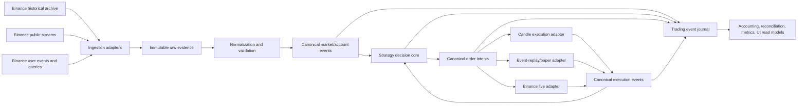

# Recommended data architecture and code-reuse assessment

Status: accepted architecture and parity specification  
Accepted by operator: 2026-07-14  
Wayfinder ticket: [Specify simulation and execution parity](../.scratch/comprehensive-grid-trading-system/issues/03-specify-simulation-and-execution-parity.md)  
Codebase basis: [Canonical capability audit](../analysis-reports/canonical-capability-audit.md)

## Recommendation

Use a tiered, provenance-first data architecture around one canonical event envelope and one deterministic strategy decision core:

1. **One-minute candles** for broad, inexpensive research.
2. **One-second candles plus Binance trades/aggregate trades** for shortlisted configurations and difficult periods.
3. **Recorded best-bid/ask, trades, targeted depth, account events, and commands** for promotion replay and operational evidence.
4. **Production public market streams with local simulated execution** for paper trading.
5. **The same normalized market streams plus authoritative Binance account events and real order commands** for live trading.

The system must not pretend these tiers have equal fill fidelity. Parity means that equivalent canonical inputs and state produce equivalent decisions; it does not mean candle simulation can reproduce exchange fills or queue position.

The operator selected this recommendation on 2026-07-14. The five decisions listed at the end of this document remain open details within the accepted architecture rather than alternatives to it.

## What already exists

### Canonical `gridlab`

| Existing capability | Evidence | Assessment |
| --- | --- | --- |
| Small candle-source interface | `gridlab/src/gridlab/data/source.py:20-27` defines `DataSource.candles()` | Retain for candle research, but do not stretch it into the online/event interface. |
| Binance REST kline pagination and cache | `gridlab/src/gridlab/data/loaders.py:108-193` | Retain/deepen. It handles paginated public klines and repeatable offline runs. |
| Supported interval map | `gridlab/src/gridlab/data/loaders.py:34-40` | Incomplete: starts at `1m`; Binance now supports `1s`. |
| Data-source-independent engine entry | `gridlab/src/gridlab/engine/engine.py:84` | Useful seam, but it materializes every candle in memory and is not streaming replay. |
| Conservative next-bar eligibility and adverse intrabar ordering | `gridlab/src/gridlab/engine/engine.py:282-309,411-426` | Retain as the low-fidelity candle simulator. |
| Candle volume participation cap | `gridlab/src/gridlab/engine/engine.py:245-257`; `config/models.py:81-85` | Useful conservative partial-fill mechanism, but it is not an exchange queue model. |
| Fill-driven strategy behavior | `gridlab/src/gridlab/strategy/grid.py:113-132,202-233` | Retain the concept, redesign the implementation for canonical cumulative pairing. |
| Single fill-derived ledger | `gridlab/src/gridlab/accounting/ledger.py:129-195` | Retain/deepen under the accounting specification. |
| JSON facade and research suite | `gridlab/src/gridlab/api/facade.py`; `gridlab/src/gridlab/research/` | Retain as the research-facing interface and provenance source. |

Important gaps and contradictions:

- The current engine input is only `Candle`; it has no canonical trade, best-bid/ask, depth, account, or execution-report event.
- Kline caching uses range-named CSV files without source checksum, archive revision, gap manifest, or schema version.
- The kline loader caps a request at 50,000 candles by default, which is less than 35 days of one-minute data and less than 14 hours of one-second data.
- `Fill.fee` is a quote-valued float with no actual fee asset; this conflicts with the confirmed fee-asset semantics.
- The engine can generate partial fills, but `GridStrategy._react_to_fills` suppresses a later partial fill when the destination rung already has an order. It does not enlarge one cumulative paired order as the confirmed MVP requires.
- Bootstrap remains configured as a percentage of initial cash (`engine.py:386-400`), not derived from initial sell obligations.
- Static Binance filter presets are useful test fixtures but cannot represent time-versioned venue rules.

### `backtester_old`

| Existing capability | Evidence | Assessment |
| --- | --- | --- |
| Historical kline downloader | `backtester_old/infra/binance_downloader.py` | Migrate the incremental-download and Parquet ideas; reject its symbol-only file identity and long blocking retry. |
| Local Parquet/CSV source and resampling | `backtester_old/infra/data_source.py` | Migrate the Parquet and reusable in-memory dataset ideas into a provenance-aware archive. |
| Closed-kline WebSocket | `backtester_old/infra/marketdata/binance_kline_stream.py` | Use as a failure-scenario source, not code reuse. It has reconnect logic but silently drops the oldest queued candle on overflow and does not recover gaps. |
| Binance user stream | `backtester_old/infra/marketdata/binance_user_stream.py` | Migrate event scenarios and reconnect/keepalive tests. Redesign against current Binance contracts and typed canonical events. |
| Deterministic client order identity | `backtester_old/core/live/order_manager.py:23-72,119-166` | Migrate the concept with a versioned, collision-safe identity and explicit idempotency lifecycle. |
| Startup open-order reconstruction | `backtester_old/core/live/order_manager.py:212-259` | Migrate as one reconciliation input, not as complete reconciliation. It clears local state and checks only currently open orders. |
| Timeout recovery by client ID | `backtester_old/core/live/order_manager.py:303-340` | Retain the scenario and expected behavior. Redesign persistence so the durable command exists before transmission. |
| Append-only JSONL plus CSV run repository | `backtester_old/core/results/live_repository.py` | Migrate the append-only journal concept. Replace CSV precision truncation and add identifiers, schema versions, sequencing, durability, deduplication, and fee assets. |
| Main-thread sequencing of execution reports and fills | `backtester_old/app/trading/runtime.py:219-260` | Useful deterministic-pump concept; redesign around the canonical event processor. |
| Periodic open-order polling | `backtester_old/app/trading/runtime.py:610-637` | Retain as a reconciliation trigger, not a sufficient reconciliation algorithm. |
| Testnet/mainnet execution adapter | `backtester_old/infra/exchange/binance_spot.py` | Migrate endpoint and order-state scenarios. Do not reuse the adapter unchanged. |

Unsafe behavior that must not migrate:

- Old `PAPER` mode sends real orders to Binance Spot Testnet. Canonical **paper trading** uses production public market data and local simulated orders. Testnet becomes a separate **venue-integration test** stage.
- Market decisions use only closed klines, so the old runtime cannot model maker entry, trade-through, order-book gaps, or queue uncertainty.
- Stream handler and order-manager exceptions are frequently logged or swallowed while trading continues (`runtime.py:178-180,242-246`).
- The queue may discard market data without a durable gap event.
- The event repository has arrival timestamps only, no exchange event time, source sequence, event ID, correlation/causation ID, payload hash, or schema version.
- Fill CSV omits Binance commission quantity and commission asset and rounds critical values to four decimals.
- Submitted intent is persisted only after the exchange call returns (`app/trading/execution.py:189-228`), leaving a crash ambiguity window.
- Initial PnL state is inferred from total account balances, which violates explicit grid allocation isolation.

### Legacy research/UI repositories

| Existing capability | Assessment |
| --- | --- |
| `grid-backtest-core` `DataSource` protocol | Useful evidence that source adapters should remain behind a seam, but it is also candle/DataFrame-only. |
| `grid-backtest-core` result artifacts | Migrate the run-directory/export idea, not its four-decimal serialization or old accounting semantics. |
| `grid-backtest-saas` persisted runs, research jobs, trials, progress, and result storage keys | Migrate selectively into the single-operator control plane. These schemas provide useful provenance fields and job lifecycle UX. |
| `grid-backtest-saas` PostgreSQL/Celery/Redis topology | Defer. It is unnecessarily heavy for the first single-node Azure deployment. |
| `gridlab-studio` JSON facade and UI | Retain as the operator shell. Add durable backend history; browser-held state is not evidence. |

## Target architecture

### Deep modules and seams

1. **Market archive module**
   - Interface: query immutable datasets by manifest identity and stream records in deterministic order.
   - Adapters: Binance public archive, Binance REST backfill, local Parquet.
   - Hides download pagination, archive revisions, checksums, partitions, compression, gaps, and resampling.

2. **Canonical event source module**
   - Interface: produce ordered canonical event envelopes.
   - Adapters: candles, historical trades, recorded depth/trades, live Binance WebSocket, user-data stream.
   - Candle aggregation is an adapter; it is not the strategy interface.

3. **Strategy decision core**
   - Interface: `consume(previous_state, canonical_event) -> decision_batch`.
   - Contains no network, filesystem, database, real-time clock, random generator, or mode-specific branch.
   - Receives an explicit logical time and configuration version.

4. **Execution module**
   - Interface: accept canonical order intents and emit canonical acknowledgments, rejections, fills, cancellations, and uncertainty events.
   - Adapters: candle simulator, trade/depth replay simulator, live-data paper simulator, Binance Testnet integration, Binance live.
   - This is a real seam because execution behavior varies across at least five adapters.

5. **Trading event journal module**
   - Interface: atomically append an ordered batch and read it back for recovery/replay.
   - Persistence failure is a trading-blocking state, never a diagnostic warning.

6. **Read-model module**
   - Interface: rebuild operator views, metrics, order state, and accounting projections from journal plus immutable configuration.
   - UI caches and exports are disposable; the journal is not.

## Canonical event envelope

Every input and output crossing the event-processing seam must carry:

- `schema_version`
- globally unique `event_id`
- `event_type`
- `source` and optional venue/source event ID
- `venue`, `market`, and `symbol`
- authoritative `event_time`
- local `received_time`
- optional source sequence/update range
- deterministic `processing_sequence`
- `run_id` and `configuration_version_id` where applicable
- `correlation_id` and `causation_id`
- exact decimal payload values, never binary-float persistence
- raw-payload reference and content hash when the event came from Binance

The strategy core uses `event_time` plus `processing_sequence`, never the machine wall clock. `received_time` is operational evidence for latency and gap diagnosis, not strategy behavior.

## Minimum canonical event and decision interface

Selected by the operator on 2026-07-14: use a versioned, typed event vocabulary and typed decision batches. Do not use an unvalidated generic JSON payload or mode-specific strategy interfaces.

The minimum first-MVP input vocabulary is:

- **Market evidence:** `CandleClosed`, `TradeObserved`, `BestBidAskChanged`, `BookDepthChanged`, and `MarketDataGapDetected`. A source emits only the evidence it actually possesses; candle replay does not manufacture trade or book events.
- **Order execution:** `OrderAcknowledged`, `OrderRejected`, `OrderPartiallyFilled`, `OrderFilled`, `OrderCancelled`, `OrderExpired`, and `OrderStatusUnknown`.
- **Account and reconciliation:** `BalanceChanged` and `ReconciliationObserved`, with the latter carrying the authoritative observations and identified differences rather than silently repairing state.
- **Venue contract:** `VenueRulesChanged` and `FeeScheduleChanged`.
- **Control and logical time:** `TimerElapsed` and `OperatorCommandReceived`.

Each call to the strategy decision core returns the resulting strategy state and exactly one `DecisionBatch`. The batch contains:

- the triggering `event_id`, run ID, and configuration version ID;
- the previous and resulting state hashes;
- an ordered list containing zero or more typed intents;
- stable reason codes plus correlation and causation identifiers.

The minimum intent vocabulary is `EnsureOrder`, `CancelOrder`, `TransitionLifecycle`, `RequestReconciliation`, and `RaiseOperatorAlert`. `EnsureOrder` declares the required order role, side, price, cumulative quantity, and execution policy. The execution adapter decides whether satisfying it requires placement, amendment, or a reconciled cancel-and-replace sequence. This supports the confirmed rule that later partial fills enlarge one cumulative paired order without embedding Binance-specific mechanics in the strategy.

An empty intent list is an explicit no-action decision, not a missing result. The core never emits a fill or claims that a venue action succeeded; only an execution event can establish that fact.

## Deterministic event ordering

Selected by the operator on 2026-07-14: use serialized observed order for online operation and recorded replay, with explicit causal ordering and a deterministic fallback for synthetic historical ties.

An event is **admitted** only after envelope validation, deduplication, and available source-sequence checks, when it is durably assigned the next `processing_sequence`. The append of the admitted input and its sequence is atomic. If that append fails, trading blocks; the runtime must not make an unjournaled decision.

The ordering contract is:

1. Explicit causation always wins. An event generated because of another event is processed after its cause, even if both have the same `event_time`.
2. A venue/source sequence is preserved within that source. A missing, regressing, or contradictory sequence produces a durable gap or ambiguity event and the required safety response.
3. In live and paper operation, otherwise independent inputs retain durable admission order. A late event is appended with a later `processing_sequence`; it is never inserted retroactively before decisions already made.
4. Recorded-event replay uses the original `processing_sequence` exactly.
5. Historical sources that lack an original processing sequence use this deterministic tie-break only after causation and source ordering: authoritative execution/account facts; operator safety commands; venue-rule, gap, and reconciliation observations; market evidence; domain timers. Within a class, use source sequence or source event ID, then canonical event ID as the final stable fallback.
6. Operator safety commands at the same synthetic instant are ordered `EmergencyStop`, `OperatorStop`, `Pause`, then `Resume` or `Start`. A resume/start cannot overtake a stop.

The fallback priority does not rewrite online history. For example, if a partial fill is admitted before an operator stop, the fill changes inventory and fees before the stop is evaluated. If the stop is admitted first, cancellation begins, but a later or late-reported fill remains authoritative and must still be accounted and reconciled.

## Deterministic replay equality

Selected by the operator on 2026-07-14: require exact equality of all deterministic domain artifacts, not merely equal final profit or economically similar orders.

The equality contract applies when the ordered input events, immutable configuration, dataset manifest, venue-rule and fee snapshots, normalizer version, execution-model version, and application build are identical. Replay is side-effect-free: recorded live execution events are inputs, while replayed order intents are compared but never transmitted.

At every `processing_sequence`, verification must establish:

1. The canonical `DecisionBatch` has byte-identical canonical serialization, including deterministic identifiers, ordered intents, exact decimals, and reason/causation data.
2. The resulting strategy state hash is identical.
3. Journaled domain outputs and their order are identical.
4. Rebuilt order, fill, inventory, allocated balance, accounting, lifecycle, and risk projections are identical.
5. Accounting and reconciliation invariants pass with no unexplained difference.

Canonical equality excludes operational observations that cannot affect domain decisions, including replay wall-clock time, host identity, process identity, CPU duration, log emission time, and newly measured latency. Such values must not enter decision serialization or state hashes.

There is no numeric tolerance for persisted domain decimals because they use canonical exact-decimal representation. A replay failure reports the first divergent processing sequence, triggering event, previous and resulting state hashes, differing canonical fields, and correlation/causation chain. Later convergence or equal final profit does not make the replay pass.

## Domain timers and operational clocks

Selected by the operator on 2026-07-14: passage of time is a canonical input whenever crossing a deadline can change orders, inventory handling, lifecycle, risk, reconciliation, or another domain decision. Housekeeping schedules that cannot directly change trading state remain operational-only.

A canonical `TimerElapsed` event carries a stable timer identity and kind, logical due time, configuration version, and causation/correlation identity. It is durably admitted before the resulting decision. Replay injects the recorded event at its original `processing_sequence`; it never waits for real time to pass.

First-MVP domain timers include:

- order acknowledgment, rejection, cancellation, replacement, and unknown-status resolution deadlines;
- post-only retry, backoff, and retry-exhaustion deadlines;
- market-data and user-stream staleness deadlines;
- reconciliation due and overdue deadlines;
- pause, recovery, and resume-verification deadlines;
- bootstrap-acquisition and stop-loss execution deadlines;
- daily-loss-period boundaries;
- explicitly configured run start/end boundaries if scheduled operation is later enabled.

Operational-only clocks and schedules include log flush/rotation, metrics sampling, dashboard refresh, WebSocket ping/keepalive transmission, backup/compaction/retention work, Azure health polling, and historical-download progress/retry scheduling. Their timestamps may appear in diagnostic evidence but cannot enter strategy state or decision hashes.

An operational component may detect that a domain threshold was crossed, but it must emit and durably admit the corresponding canonical event before trading state changes. For example, a WebSocket ping schedule is operational; the configured market-data staleness deadline and resulting safety transition are domain behavior. Exact durations belong to the order-recovery, reconciliation, risk, and observability specifications.

## Data tiers and retention intent

| Tier | Data | Purpose | Recommended storage |
| --- | --- | --- | --- |
| Research | 1-minute OHLCV for selected liquid Spot symbols | Broad search, walk-forward, regime and sensitivity analysis | Partitioned compressed Parquet; retain long term |
| Detailed candle | 1-second OHLCV for shortlisted symbols/periods | Intrabar sensitivity and stress cases | Partitioned compressed Parquet; retain promotion datasets |
| Historical event | Raw trades or aggregate trades | Higher-fidelity ordering and volume replay | Immutable source archive plus normalized Parquet |
| Captured market | Best bid/ask, trades, and targeted top-of-book/depth updates during active paper/live windows | Maker-entry, gaps, operational replay | Append during run; compact to Parquet after validation |
| Trading evidence | Decisions, commands, acknowledgments, fills, fees, balances, reconciliations, risk transitions | Audit, restart recovery, live parity | Transactional append-only journal; retain for the life of the system |
| Derived views | Candles, metrics, charts, job progress, current state | UI and analysis convenience | Rebuildable SQLite tables/caches and export files |

Do not continuously retain complete full-depth data. For the MVP, capture real-time best bid/ask and trades for the active symbol, plus targeted shallow/diff depth only during paper/live runs and incident windows. Exact retention periods belong to the observability and Azure tickets.

## Minimal single-node storage recommendation

- **Compressed Parquet** for bulk historical candles, trades, normalized market events, and completed-run market captures.
- **SQLite in WAL mode** for the single-operator control plane, manifests, configuration versions, job state, append-only trading journal, and projections.
- **Source ZIP files and checksums** retained for evidence datasets used in promotion; derived Parquet records the source hashes.
- **JSONL only as an export/interchange format**, not as the sole live system of record.
- Regular snapshot/backup to durable Azure storage; exact disk and Blob layout is deferred to the Azure deployment investigation.

This avoids PostgreSQL, Redis, and Celery in the first Azure deployment while preserving seams that permit later replacement if measured concurrency or volume requires it.

## Dataset manifest

Every research or promotion run references an immutable manifest containing:

- dataset ID and schema version
- venue, market, symbol, event kind, and requested interval
- inclusive/exclusive UTC time range
- source URLs/paths and download timestamps
- source and normalized file hashes
- archive revision/checksum information
- row/event counts and first/last source IDs
- duplicate, gap, out-of-order, and invalid-record counts
- timezone and timestamp precision
- resampling rule and parent dataset ID
- venue-filter/fee snapshot identity
- normalization software version

A corrected Binance archive file creates a new manifest identity. Existing results continue pointing to the evidence they actually used.

## Mode contract

| Mode | Input adapter | Execution adapter | Fill authority |
| --- | --- | --- | --- |
| One-minute research | Closed candle events | Conservative candle simulator | Explicit candle assumptions |
| One-second validation | Closed candle events | Same candle simulator | Explicit candle assumptions |
| Historical event replay | Trade/aggregate-trade events, optionally recorded book evidence | Conservative replay simulator | Trade-through, volume, and configured queue assumptions |
| Paper trading | Production public market streams | Local paper simulator | Observed trades/book plus conservative paper policy |
| Venue-integration test | Binance test environment | Binance test adapter | Test environment; operational evidence only |
| Live trading | Production public market streams and account events | Binance live adapter | Binance execution and account events, reconciled by queries |

Paper and live must normalize market data into the same canonical events. They share the decision core and journal. Only execution authority changes.

## Fill policies by fidelity

Selected by the operator on 2026-07-14: primary promotion results use a mandatory conservative policy. More optimistic assumptions are allowed only as clearly labelled sensitivity scenarios and cannot replace the primary result.

- **All simulation:** an order becomes fill-eligible only after it is acknowledged as resting. Every fill consumes a tracked liquidity budget; the same observed volume cannot be reused for multiple orders. The default maximum participation is 5% of eligible observed volume. This value may be varied in immutable sensitivity configurations, but promotion always includes the 5% result.
- **Candle simulation:** normal rung orders become eligible no earlier than the next candle. A buy requires `low < limit`; a sell requires `high > limit`. Equality is a touch and does not fill the primary result. Ambiguous intrabar movement uses the adverse path. A maker fill is priced at its limit; favorable gap price improvement requires event-level evidence and is not inferred from OHLC alone.
- **Trade replay without book depth:** only trades admitted after the order became resting are eligible, and price must trade strictly through the limit. At-price trades are retained as evidence but do not create a primary simulated fill because queue position is unknown.
- **Trade replay with book depth:** initialize queue ahead from displayed quantity already resting at the price when the order is acknowledged. At-price eligible volume first consumes that queue; only subsequent eligible volume may fill the simulated order, subject to the 5% participation limit. Missing or inconsistent depth downgrades to the no-depth rule rather than assuming priority.
- **Paper:** apply the same trade/book rules to production public market data. Journal the observed evidence, queue evolution, liquidity-budget consumption, and every simulated fill decision so replay can reproduce it.
- **Live:** only Binance execution/account evidence creates fills. Missing, duplicated, late, or out-of-order reports go through deduplication and reconciliation; no simulator manufactures a live fill.

Touch fills, same-candle eligibility, participation above 5%, favorable inferred gap prices, and optimistic/no-queue assumptions may be run for sensitivity analysis but must be labelled non-promotion evidence.

Historical trades alone cannot prove historical queue position. This limitation must remain visible in promotion evidence rather than being hidden behind a precise-looking fill timestamp.

The canonical code currently defaults to `fill_on_touch=True`, `fill_gaps_at_open=True`, and unlimited participation. Those defaults are retained only as legacy behavior until implementation; they do not satisfy the selected promotion policy.

## Migration sequence

1. Freeze legacy repositories as references and extract failure scenarios/tests before archiving.
2. Introduce canonical envelopes, exact decimal serialization, configuration identity, and deterministic processing sequence in `gridlab`.
3. Preserve the existing candle engine behind a candle execution adapter; prove old canonical test behavior through that adapter.
4. Fix obligation-derived bootstrap, actual fee assets, and cumulative partial-fill pairing before treating event replay as meaningful.
5. Build manifest-driven Binance archive ingestion with `1m`, `1s`, trades, and aggregate trades; reuse Parquet and incremental-download ideas from old code.
6. Build recorded-event replay and prove repeated replay produces byte-equivalent decisions and accounting state.
7. Redesign Binance market/user adapters from old scenarios with gap detection, typed failures, durable command-before-send, and reconciliation.
8. Add production-data/local-execution paper mode; keep Binance Testnet as a distinct venue-integration mode.
9. Connect live execution only after accounting, risk, observability, recovery, and promotion specifications pass.

## Acceptance consequences

- Existing code provides substantial useful material, so this is not a greenfield system.
- No old online module is safe to import unchanged.
- `gridlab` remains the canonical engine, but its current `BacktestEngine` is a candle adapter, not yet the shared decision core.
- The SaaS database/job model and old Parquet/JSONL work should be selectively reimplemented around the canonical journal and manifests.
- One-minute candles are the default research dataset; one-second data is an escalation tier, not the universal storage format.

## External primary sources

- [Binance public market-data archive](https://github.com/binance/binance-public-data) — official daily/monthly Spot klines, raw trades, and aggregate trades; currently lists `1s` as the smallest kline interval and does not list a native `30s` interval.
- [Binance Spot REST guidance](https://developers.binance.com/en/docs/products/spot/rest-api) — request ambiguity, status recovery, timing, rate limits, and public/private data endpoints.
- [Binance Spot user-data stream](https://developers.binance.com/en/docs/products/spot/user-data-stream) — authoritative account and execution event contract.
- [Binance Spot trading endpoints](https://developers.binance.com/en/docs/catalog/core-trading-spot-trading/api/rest-api/trade) — order submission, query, cancellation, identifiers, and supported order types.

## Parity decisions

1. **Selected:** versioned typed canonical events and typed decision batches form the minimum first-MVP interface.
2. **Selected:** serialized durable admission order, preserved causation/source order, exact recorded replay, and an explicit deterministic fallback for synthetic timestamp ties.
3. **Selected:** conservative promotion fills require resting eligibility, strict candle crossing or evidence-backed queue consumption, adverse ambiguity handling, and a 5% non-reusable liquidity budget; optimistic variants are sensitivity-only.
4. **Selected:** exact decision bytes, per-event state hashes, ordered domain outputs, rebuilt projections, and accounting/reconciliation invariants must all agree; operational metadata is excluded.
5. **Selected:** deadlines capable of changing domain state are canonical timer events; housekeeping and measurement clocks remain operational-only and cannot mutate trading state directly.
