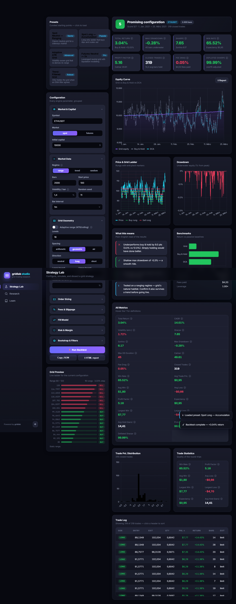

# gridlab studio

A beautiful, informative, no-build-step web studio for the **[gridlab](../gridlab)**
grid-trading backtester. It wraps the gridlab engine in a small FastAPI service and
serves a bespoke vanilla-JS single-page app — so the whole thing launches with one
command and opens in your browser.

> Strategy Lab → configure a grid, preview the ladder, run a backtest, and read a
> plain-English verdict. Research Lab → parameter sweeps, walk-forward, and Monte-Carlo
> robustness. Learn → when grids work, when they fail, and how to make them robust.



---

## Why this exists

`gridlab` is a clean Python backtesting engine. `gridlab-studio` makes it *usable
without writing code* and *interpretable without being a quant*:

- **One source of truth.** The studio never re-implements defaults or validation — it
  forwards a declarative spec straight into gridlab's `run_backtest(spec)` facade and
  research functions. If the engine changes a default, the studio follows automatically.
- **No build step.** Pure FastAPI + a hand-written design system (CSS variables) +
  Chart.js from a CDN. No npm, no bundler, no transpile. `python run.py` is the whole
  toolchain.
- **Informative by default.** Every run produces an opinionated verdict, plain-English
  insights, benchmark comparisons (Buy & Hold / DCA), a grid-overlay price chart with
  trade markers, drawdown, a trade-PnL distribution, and full metrics with tooltips.

---

## Quick start

From this directory (inside the dev environment / a venv with Python 3.12):

```bash
pip install -e .          # installs gridlab-studio + gridlab (editable, from ../gridlab)
python run.py             # starts the server and opens http://127.0.0.1:8000
```

Useful flags:

```bash
python run.py --port 8011         # pick a port
python run.py --no-open           # don't auto-open the browser
python run.py --reload            # auto-reload on backend changes (dev)
python run.py --host 0.0.0.0      # expose on the network
```

You can also run the ASGI app directly:

```bash
uvicorn backend.app:app --port 8000
# or, via the console script installed by pip:
gridlab-studio
```

---

## Architecture

```
                ┌────────────────────────────────────────────┐
  Browser  ◄───►│  FastAPI (backend/app.py)                  │
  (SPA)         │   /api/*  → backend/service.py → gridlab     │
                │   /       → StaticFiles(frontend/)           │
                └────────────────────────────────────────────┘
```

- **`backend/app.py`** — FastAPI routes (`/api/*`) plus a static mount that serves the
  SPA. The mount is added *last* so API routes always win. A `_guard` wrapper turns
  engine `ValueError`/`KeyError` into clean HTTP 400s; Pydantic field violations return
  422 automatically.
- **`backend/schemas.py`** — Pydantic request models. Every nested config block mirrors a
  gridlab config object but keeps **all fields optional**. `BacktestRequest.to_spec()`
  dumps with `exclude_none=True` and drops empty blocks, so gridlab stays the single
  source of defaults.
- **`backend/service.py`** — the only module that talks to gridlab. It drives the engine
  directly (not just the facade) to build a rich, JSON-safe payload: down-sampled and
  **index-aligned** equity / price / benchmark / drawdown curves, trade markers mapped to
  positions in the down-sampled array, an opinionated verdict, plain-English insights, and
  the research transforms (heatmap, walk-forward folds, Monte-Carlo histogram).
- **`backend/presets.py`** — 5 curated presets, per-metric metadata (label / format /
  good-direction / help text), the headline-metric list, and the grid-trading guide that
  powers the Learn tab. This is the "informative" backbone.
- **`frontend/`** — the SPA. A custom CSS design system (`css/styles.css`, light + dark)
  and ES-module JavaScript (`js/*.js`) with no framework. Chart.js is the only runtime
  dependency, loaded from a CDN.

### Frontend modules

| File | Responsibility |
|------|----------------|
| `js/app.js` | App controller: state, routing (Lab / Research / Learn), dashboard assembly |
| `js/charts.js` | Chart.js builders (all in down-sampled "position space" so curves + markers align) |
| `js/schema.js` | Declarative field schema → config accordion + live grid-ladder preview |
| `js/ui.js` | Reusable components (KPI, verdict banner, sortable table, accordion, toasts…) |
| `js/api.js` | Tiny REST client + report blob download |
| `js/format.js` | Number/price/percent formatters + DOM helpers |

---

## API reference

All compute endpoints accept JSON and return JSON. The `spec` shape is the same one
gridlab's facade consumes; every field is optional and falls back to an engine default.

| Method | Path | Body | Returns |
|--------|------|------|---------|
| `GET`  | `/api/health` | — | service status |
| `GET`  | `/api/meta` | — | presets, default spec, metric metadata, enums, objectives, guide |
| `POST` | `/api/backtest` | `{spec, options}` | metrics, aligned series, benchmarks, trades, insights, verdict |
| `POST` | `/api/grid-preview` | `{spec}` | grid rung prices for the live ladder |
| `POST` | `/api/report` | `{spec}` | standalone HTML report (file download) |
| `POST` | `/api/research/grid-search` | `{base, space, objective, maximize, top_k}` | leaderboard + 2-axis heatmap |
| `POST` | `/api/research/walk-forward` | `{base, space, n_splits, objective}` | IS/OOS folds + summary |
| `POST` | `/api/research/monte-carlo` | `{base, method, n_sims, seed}` | percentiles + return-distribution histogram |
| `GET`  | `/api/studio/catalogs/binance/eur` | optional `refresh=true` query | current production/Testnet EUR compatibility catalog, coverage, and liquidity evidence |
| `POST` | `/api/studio/datasets/binance/preview` | symbol, `1m`, and a bounded UTC range | official source objects, sizes, and expected SHA-256 values |
| `POST` | `/api/studio/datasets/binance/import` | a server-owned preview identity | verified source evidence, typed Parquet, and an immutable dataset manifest |
| `POST` | `/api/studio/backtests/manifested` | dataset identity and backtest specification | deterministic result fingerprint with production-history provenance |

The typed Studio at `/studio/` discovers the current public Binance Spot EUR symbols
that are compatible with both production and Testnet, then exposes their official
production-history coverage and bounded liquidity evidence. Public compatibility does
not prove that an authenticated German account may trade a symbol; the operator must
confirm account permissions separately. The only admitted candle interval is `1m`.

The Studio and backend permit at most seven complete UTC days, seven archive objects,
and 256 MiB per request by default. Deployments can tighten those caps with
`GRIDLAB_DATA_MAX_DAYS`, `GRIDLAB_DATA_MAX_OBJECTS`, and `GRIDLAB_DATA_MAX_BYTES`.
Source ZIPs and checksum evidence are retained beside normalized Parquet under the
ignored local `.studio/datasets` store. A gap, duplicate, invalid timestamp era,
replaced sidecar, corrupt archive, or checksum mismatch prevents admission; no
interpolation or silent repair is performed. Testnet history is never presented as
production economic evidence.

### Example: run a backtest

```bash
curl -s http://127.0.0.1:8000/api/backtest \
  -H "Content-Type: application/json" \
  -d '{
        "spec": {
          "symbol": "ETHUSDT",
          "grid": {"levels": 16, "lower": 90, "upper": 110, "spacing": "geometric"},
          "sizing": {"mode": "fixed_quote", "value": 50},
          "data": {"kind": "synthetic", "n": 2000, "regime": "range", "seed": 11}
        },
        "options": {"include_trades": true}
      }'
```

Key response fields: `metrics` (all engine metrics), `series` (aligned down-sampled
curves), `benchmarks.buy_and_hold` / `benchmarks.dca`, `trades` (with `entry_x`/`exit_x`
positions for chart markers), `insights` (list of plain-English notes), and `verdict`
(`label` / `tone` / `score` / `max_score`).

> **Using your own price data?** Set `data.kind = "dataframe"` and pass OHLCV rows in
> `data.records` (list of `{timestamp, open, high, low, close, volume}` dicts).

---

## Building your own frontend / API consumer

The SPA in `frontend/` is one consumer of the API — nothing about the backend is tied to
it. To build a different UI (React, mobile, a Jupyter dashboard…):

1. Call `GET /api/meta` once on load to get presets, the default spec, metric metadata,
   enum choices, and objective list — enough to render a full configurator generically.
2. Let the user edit a copy of `default_spec`; clear a field to fall back to the engine
   default (the backend ignores `null`/missing values).
3. `POST /api/backtest` to run; render `series` (already aligned and down-sampled for
   direct charting), `metrics`, `benchmarks`, `verdict`, and `insights`.
4. Use the `/api/research/*` endpoints for sweeps, walk-forward and Monte-Carlo.

CORS is open (`*`) so a separate dev server can call the API directly.

---

## Testing

```bash
python -m pytest tests/ -q
```

Routine acquisition and replay tests use generated, bounded archive fixtures. The real
network acceptance downloads exactly one fixed official object (`BTCUSDT`, Spot `1m`,
`2025-01-01` UTC) and is opt-in:

```bash
GRIDLAB_REAL_BINANCE_ACCEPTANCE=1 python -m pytest \
  gridlab/tests/test_binance_archive_network.py -q
GRIDLAB_REAL_BINANCE_BROWSER=1 pnpm --dir gridlab-studio/frontend-typed run test:browser
```

`tests/test_api.py` exercises every route end-to-end via FastAPI's `TestClient`
(no live server needed), with small/fast deterministic specs. It also checks the
critical invariants: aligned series lengths, trade-marker positions inside the
down-sampled range, leaderboard sort order, heatmap dimensions, and validation → 422.

### Browser smoke test (optional)

The SPA was validated headlessly with Playwright (load → preset → backtest → all charts →
theme toggle → all three research tabs → Learn) with zero console/page errors. To repeat:

```bash
pip install playwright && python -m playwright install chromium
# start the server, then drive http://127.0.0.1:<port>/ with a Playwright script
```

---

## Project layout

```
gridlab-studio/
├── backend/
│   ├── app.py          # FastAPI routes + static SPA mount
│   ├── schemas.py      # Pydantic request models (all-optional → exclude_none)
│   ├── service.py      # the only module that talks to gridlab
│   └── presets.py      # presets, metric metadata, grid-trading guide
├── frontend/
│   ├── index.html
│   ├── css/styles.css  # bespoke design system (light + dark)
│   └── js/             # api, format, ui, charts, schema, app (ES modules)
├── tests/test_api.py
├── run.py              # launcher (opens the browser)
└── pyproject.toml
```

---

## Relationship to gridlab

`gridlab-studio` depends on `gridlab` as an editable local package
(`[tool.uv.sources] gridlab = { path = "../gridlab", editable = true }`). The studio adds
**no trading logic** — all simulation, metrics, benchmarks, and research live in gridlab.
Keep both in the same parent folder so the editable path resolves.
